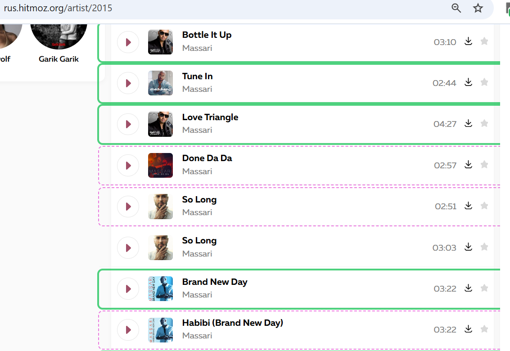

# Unique Tracks Selector

Unique Tracks Selector is a small browser extension for finding fresh tracks on music search/listing sites that contain many duplicate search results.

It highlights tracks directly on the page:

- solid green border: first time seen;
- dashed violet border: another version, remix, or variant of a previously seen track;
- no border: exact duplicate.

The extension also remembers tracks across multiple pages and supported sites, so duplicates seen earlier are still taken into account later.

## Why I Made It

I use free music sites to browse artists I already know, but the same tracks often appear again and again: original versions, remixes, reuploads, search-result duplicates, and slightly different naming.

With this extension, browsing feels less like digging through a messy pile of repeated results and more like opening a cleaner layer of tracks worth checking.

## Installation

You can install it as an unpacked browser extension.

1. Download and extract the packaged extension ZIP:  
   [unique-tracks-selector.zip](https://github.com/MikhailMashukov/unique-tracks-selector/releases/download/v0.6/unique-tracks-selector.zip)  
   Release notes: [Version 0.6](https://github.com/MikhailMashukov/unique-tracks-selector/releases/tag/v0.6)
2. Open Chrome.
3. Open the menu by clicking the three dots in the top-right corner and select `Extensions`. Alternatively, open `chrome://extensions` directly.
4. Enable `Developer mode` in the top-right corner.
5. Click `Load unpacked`.
6. Select the extracted extension directory.
7. Optional: pin the extension to the toolbar.
8. Open a music website, for example: `https://rus.hitmoz.org/search?q=Massari`.
9. Click the extension icon. Tracks on the page should become highlighted with borders.
10. You can close the popup window after that. The extension will keep working on the page.

## Notes

- The extension is free.
- The source code is plain and unobfuscated, so you can inspect it manually before installation.
- It is currently distributed as an unpacked extension, not through the Chrome Web Store.

## Privacy

Unique Tracks Selector reads track information from music search/listing pages and stores seen-track data locally in your browser. The extension also includes basic PostHog analytics for popup usage events, only to notify me that somebody is using the extension. The analytics records only that certain popup actions happened, e.g. that popup was opened. It does not record e.g. who clicked them nor on which site.

See [PRIVACY.md](PRIVACY.md) for details.

## License

This project is source-available now, but not open-source.

The source code is provided for transparency and inspection only. You may use the packaged extension for personal use, but you may not copy, modify, redistribute, or publish derivative versions without explicit permission. 

Feedback is welcome. If you try the extension, I would appreciate hearing what works, what does not, and which music sites or workflows you would like it to support better.

If you are interested in testing or helping in another way, feel free to open an issue or contact me.